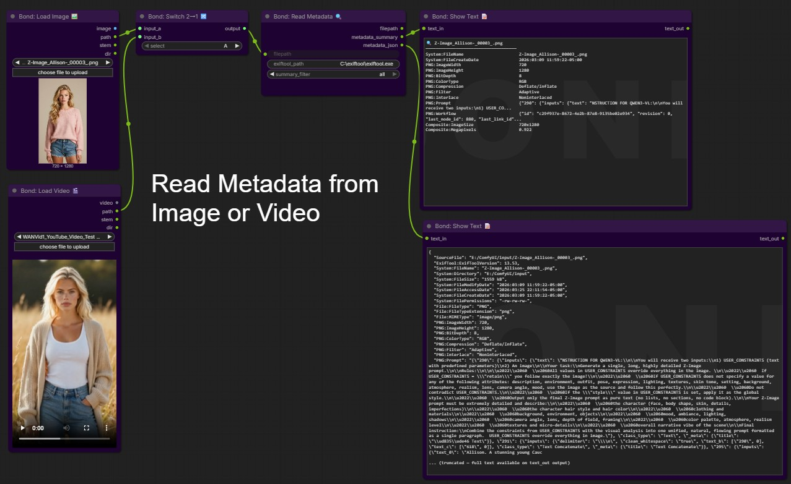
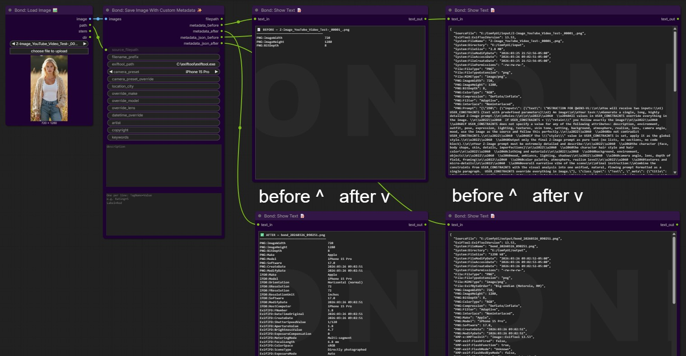
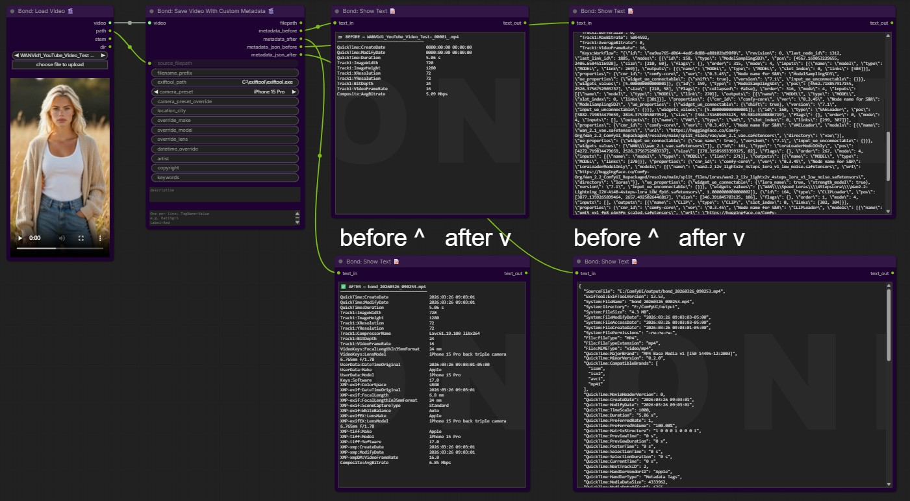

# Bond Node Suite for ComfyUI

A collection of high-utility custom nodes for ComfyUI focused on batch processing, complex indexing, iterator logic, and image/video metadata management.

## 🚀 Installation
1. `cd custom_nodes`
2. `git clone https://github.com/bondngn-studios/Bond-Node-Suite/`
3. Restart ComfyUI.

> **Metadata nodes require [exiftool](https://exiftool.org/)**
>
> **Windows:** Download the Windows Executable, rename `exiftool(-k).exe` to `exiftool.exe`, and place it (along with the `exiftool_files/` folder) somewhere permanent. Set the `exiftool_path` widget on any metadata node to the full path, e.g. `C:\exiftool\exiftool.exe`.
>
> **RunPod / Simplepod / Jupyter (Linux):** Open a terminal and run:
> ```bash
> apt-get install -y exiftool
> ```
> Leave the `exiftool_path` widget in the nodes at its default value of `exiftool` — no path override needed.


---

## 📷 About Metadata Masking

The Bond metadata nodes are designed to make your AI-generated images and videos look like they came from a real camera or phone. Here's what that means in plain terms — what we can change, what we can't, and how to get the best results.

### What metadata is
Every photo and video file carries hidden data called metadata — the camera make and model, lens information, GPS location, date and time, and much more. Apps like Instagram, Google Photos, and most professional photo tools read this data automatically. By default, AI-generated files have no camera metadata at all, or worse, they contain tags that clearly identify them as AI-generated.

### What Bond-Node-Suite can change ✅
- **Camera identity** — Make, model, lens, aperture, focal length, shutter speed, ISO. Presets are available for popular iPhones, Samsung, Pixel, Sony, Canon, and Nikon.
- **GPS location** — Geocoded from any city or landmark name. Just type "Nashville, TN" or "Eiffel Tower, Paris."
- **Date and time** — Set to any date, or leave blank to use the current time.
- **Rights and credits** — Artist, copyright, description, keywords.
- **Video-specific tags** — Frame rate, duration, resolution, codec info, and track timestamps are all written with proper camera-style values.

### What Bond-Node-Suite cannot change ❌
- **The file path** — If your ComfyUI output folder is named `ComfyUI`, that path will appear in the metadata. 
- **The ffmpeg encoder string** — Bond does its best to overwrite this, but some metadata viewers may still detect traces of the video encoder. This is a technical limitation of how MP4 files store codec information.
- **The AI model's fingerprint** — Some forensic tools analyze pixel patterns, not just metadata, to detect AI generation. Metadata masking does not affect this.
- **Frame rate anomalies** — If your AI model generates video at an unusual frame rate (like 16fps), that will appear in the file. Real phones shoot at 24, 30, or 60fps. Choose a matching frame rate in your generation node when possible.

### Best practices for convincing results
1. Choose a camera preset that matches the resolution and aspect ratio of your generated image. A 720x1280 portrait image pairs naturally with an iPhone preset.
2. Set a realistic date and time — leaving it blank uses the current time, which is fine for recent "shots."
3. Add a city location if it makes sense for the scene.

> **Note:** Bond metadata nodes are intended for creative, artistic, and educational use — for example, creating portfolio content, film production assets, or social media content where realistic camera provenance adds to the creative work. Users are responsible for how they use this tool.

## Read Metadata


## Overwrite Image Metadata


## Overwrite Video Metadata



---
## 🛠 Nodes

### Bond/Batch

#### Cartesian Index Driver (Image) & Cartesian Index Driver (Img + Prompt)
Map a master counter `i` to a multi-dimensional grid. Perfect for running every outfit against every background, or every prompt against every image.

#### Prompt JSON/TXT Selector
Designed to work with the Cartesian `idxP` output.
- **Modes:** Auto-detects JSON arrays (`["p1", "p2"]`) or TXT files (one prompt per line)
- **Control:** Wrap (loop back) or clamp (hold last) when the index exceeds the list size
- See `samplePrompts/` in the repo for correct formatting

#### Bond: Prompt Array Iterator
Thread-safe iterator for JSON prompt arrays with built-in seed syncing and advance-on-execution logic.

#### Bond: Range Stepper
A stateful counter that auto-increments with every queue run.

#### Bond: Batch → Int Pick / Bond: Batch → String Pick
Pluck a single value from a batch by index.

---

### Bond/Utilities

#### Bond: Load Image 🖼️
Upload-based image loader with a **choose file to upload** button and image preview — just like the native ComfyUI Load Image node. Outputs `image`, `path`, `stem`, and `dir` for use with metadata nodes.

#### Bond: Load Image From Path
Load an image from a typed absolute file path. Best for local batch workflows where files are already on disk. Same outputs as Bond: Load Image.

#### Bond: Load Video 🎬
Upload-based video loader with a **choose file to upload** button — just like Bond: Load Image. Outputs `video`, `path`, `stem`, and `dir`. Wire `video` into any video-aware node. Wire `path` into Bond: Read Metadata, Bond: Strip Metadata, or `source_filepath` on Bond: Save Video With Custom Metadata for a metadata before/after readout. Uses lazy loading — no frames are decoded until something downstream actually needs them, so there is no VRAM hit on load.

#### Bond: Load Video From Path
Pass a video filepath into the workflow as a typed string. Validates the file exists and outputs `path`, `stem`, and `dir`. Use when your video is already on disk and you don't need a file picker.

#### Bond: Batch Image Loader
Point to a directory and load images one at a time. Supports `single_image` (by index), `sequential` (auto-advances each run), and `random` (seed-driven) modes. Outputs `image`, `filename_text`, `path`, `dir`, `index`, and `total`.

#### Bond: Switch 2→1 🔀
Routes one of two inputs to a single output based on an A/B selector. Works with any data type — images, strings, latents, masks, anything. Select `A` to pass `input_a` through, or `B` to pass `input_b` through. Use to toggle between two branches without rewiring.

#### Bond: Switch 1→2 🔀
Routes a single input to one of two outputs based on an A/B selector. Select `A` to send to `output_a`, or `B` to send to `output_b`. The inactive output will be `None`. Use to send your output to one of two downstream nodes without rewiring.

#### Bond: Show Text 📝
Display any string output directly inside the node body. Wire any STRING into `text_in` — text renders inline with a monospace font and a subtle Bond watermark. Passes the string through as `text_out` for chaining. Text persists across page reloads.

> Large text inputs (e.g. raw JSON blobs) are truncated to 8000 characters in the display. The full string is always available on the `text_out` output.

---

### Bond/Metadata

> All metadata nodes require **exiftool** — see installation note above.
> Metadata nodes are color-coded purple for easy identification on the canvas.

#### Bond: Global Metadata Settings 🌐
A single control point for camera preset and location across your entire workflow. Set `camera_preset` and `location_city` once and wire both outputs into as many save nodes as you need. Wire `camera_preset_override` into the matching input on Bond: Save Image With Custom Metadata or Bond: Save Video With Custom Metadata.

#### Bond: Save Image With Custom Metadata ✨
The all-in-one image save and metadata node. Wire in an image and its source filepath, and it will:
1. Read and display the **original metadata** (before)
2. Save a fresh PNG to your specified output path
3. Stamp new custom metadata onto it
4. Read back and display the **new metadata** (after)

Outputs `filepath`, `metadata_before`, `metadata_after`, `metadata_json_before`, and `metadata_json_after` — wire the human-readable outputs into Bond: Show Text nodes for a live before/after comparison.

**Wiring:**
```
Bond: Load Image  (or Bond: Load Image From Path)
  ├── image  →  images
  └── path   →  source_filepath
```

**Camera Presets:** iPhone 15 Pro, iPhone 14 Pro, iPhone 13, Samsung Galaxy S24 Ultra, Google Pixel 8 Pro, Sony A7R V, Canon EOS R5, Nikon Z9, or Manual.

**Metadata fields:** Camera make/model/lens, GPS location (geocoded from city name via Nominatim — requires internet), date/time, artist, copyright, keywords, description, and freeform XMP tags.

#### Bond: Save Video With Custom Metadata 🎬
Saves a generated video to disk as MP4 and stamps realistic EXIF, XMP, and QuickTime metadata via exiftool and ffmpeg. Wire a VIDEO tensor from any video generation node into `video`. Optionally wire `path` from Bond: Load Video into `source_filepath` to capture a metadata-before readout.

Video-specific metadata is computed automatically from the generated clip — frame rate, duration, resolution, codec, and audio info are all written to the proper QuickTime/xmpDM namespaces. Still-camera tags that don't apply to video (shutter speed, aperture, ISO, flash, etc.) are intentionally excluded.

**Wiring:**
```
[Video Generation Node]
  └── video  →  video

Bond: Load Video 🎬  (optional, for metadata_before)
  └── path   →  source_filepath
```

#### Bond: Read Metadata 🔍
Read all metadata from any image or video file using exiftool. Outputs a formatted human-readable summary and raw JSON. Use `common_only` filter for the most useful tags, or `all` to see everything exiftool finds. Filepath passes through unchanged for chaining into other nodes.

#### Bond: Strip Metadata 🧹
Strip ALL metadata from an image or video file in-place using exiftool. Optional backup before stripping. Works with PNG, JPEG, WEBP, MP4, MOV, MKV, and most formats exiftool handles. Filepath passes through for chaining.

---

## 📁 Sample Files

- **`samplePrompts/`** — Sample JSON prompt file showing the correct format for Bond: Prompt Array Iterator
- **`Bond_Studios_Workflows/`** — Workflows from Bond Studios YouTube videos
- **`resources/`** — Includes one-off files that I might create as part of my videos

---

## 📺 YouTube & Community
Workflows from YouTube videos are in the `Bond_Studios_Workflows/` folder in this repo.
